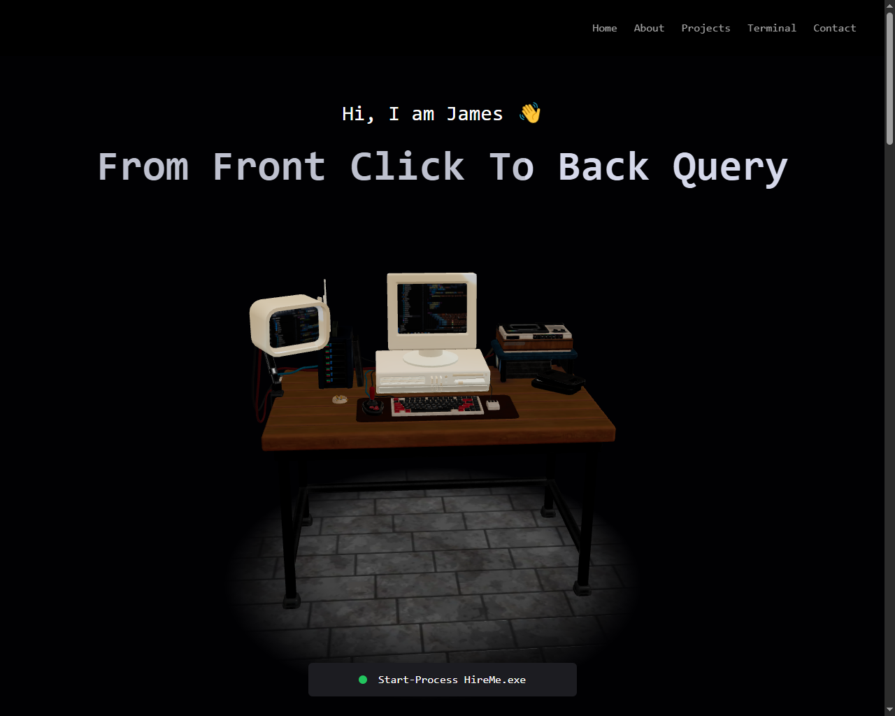
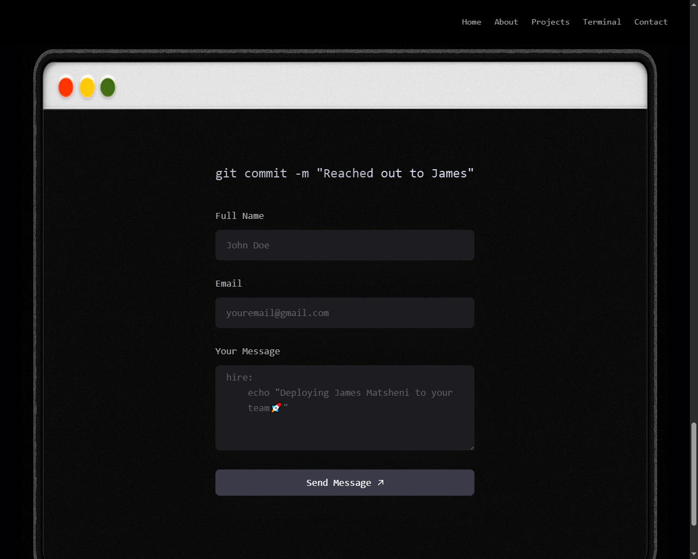

# 👨‍💻 James Matsheni

## Full-Stack Developer | Real-Time Systems Engineer

Building scalable MERN applications, real-time systems, AI-powered platforms, and secure payment integrations.

🌐 **Live Portfolio:** https://portfolio-beta-drab-76.vercel.app

💼 **LinkedIn:** https://www.linkedin.com/in/james-matsheni-4bb7643b9

🐙 **GitHub:** https://github.com/coffee-driven-dev007

---

# 🚀 Overview

This repository contains my personal developer portfolio — an interactive 3D web experience built to showcase:

* Production-style full-stack applications
* Real-time and concurrent systems
* AI-powered workflows
* Payment integrations
* Scalable backend architecture

The goal is not only to display projects, but to demonstrate how I approach software engineering: building systems that remain reliable when real users, real traffic, and real-world constraints are involved.

---

# ✨ Features

* Interactive 3D experience powered by Three.js
* Terminal-inspired navigation and UI
* Fully responsive design
* Smooth animations and transitions
* Dynamic project showcase
* Skills and technology overview
* Contact and social integration
* Performance-focused architecture
* Production deployment via Vercel

---

# 📸 Screenshots

> Replace these placeholders with actual screenshots.

```text
screenshots/
├── homepage.png
├── projects.png
└── terminal.png
```

### Homepage



### Projects Section


### Terminal Experience



---

# 💡 Why I Built This

Most developer portfolios simply list projects.

I wanted a portfolio that demonstrates both technical depth and product thinking:

* 3D web experiences
* Interactive interfaces
* Component-driven architecture
* Performance optimization
* Responsive design
* Modern deployment workflows

The result is a portfolio that feels more like a product than a traditional portfolio website.

---

# 🏗 Architecture Highlights

The portfolio is structured using modern frontend engineering principles:

* Component-based React architecture
* Reusable UI components
* Three.js scene management
* Optimized asset loading
* Responsive design patterns
* Scalable folder structure
* Clean separation of concerns
* Vercel production deployment

## High-Level Architecture

```text
User
 │
 ▼
React + Three.js Frontend
 │
 ▼
Routing / State Management
 │
 ▼
Project Data + External APIs
 │
 ▼
Vercel Deployment Platform
```

---

# 🛠 Tech Stack

## Frontend

* React.js
* JavaScript (ES6+)
* Three.js
* Tailwind CSS
* HTML5
* CSS3

## Backend & APIs

* REST APIs
* OpenAI API Integration
* Stripe Integration

## Tools & Deployment

* Git
* GitHub
* Vercel
* VS Code
* NPM

---

# 📂 Featured Projects

## 🎬 Popcorn Palace — Real-Time Booking System

**Live Demo:** https://booking-app-five-mu.vercel.app

A full-stack movie booking platform designed to handle concurrent users and prevent double bookings.

### Key Features

* Real-time seat availability
* Seat-locking mechanism
* Stripe payment integration
* User authentication
* Admin dashboard
* Event-driven workflows

### Engineering Challenges Solved

* Preventing double bookings
* Maintaining seat-state consistency
* Handling concurrent user actions
* Reliable payment processing

### Tech Stack

MongoDB • Express • React • Node.js • Stripe • Clerk • Inngest

---

## ✏️ ThinkBoard — Real-Time Collaborative Whiteboard

**Live Demo:** https://real-time-white-board-wheat.vercel.app

A collaborative whiteboard that enables multiple users to draw simultaneously through WebSockets.

### Key Features

* Multi-user collaboration
* Real-time synchronization
* Drawing and erasing tools
* Export to PNG
* Export to PDF

### Engineering Challenges Solved

* Low-latency communication
* Shared state consistency
* Concurrent editing synchronization
* Efficient event broadcasting

### Tech Stack

React • Node.js • Socket.IO • HTML5 Canvas • JavaScript

---

## ⚽ Pitchside — AI Content Platform

**Live Demo:** https://soccer-blog-nine.vercel.app

An AI-powered blogging platform featuring automated content generation and moderation workflows.

### Key Features

* OpenAI article generation
* Admin review workflow
* Content management system
* Secure authentication
* Publishing workflow

### Tech Stack

MongoDB • Express • React • Node.js • OpenAI API

---

## 🍗 KFC Delivery Platform

**Live Demo:** https://kfc-delivery-application.vercel.app

A food ordering and delivery application inspired by modern restaurant platforms.

### Key Features

* Shopping cart
* Order management
* Stripe payments
* Authentication system
* Admin dashboard

### Tech Stack

MongoDB • Express • React • Node.js • Redux • Stripe

---

# 🧠 Engineering Focus

I enjoy building systems that remain reliable under real-world conditions.

## Areas of Focus

* Real-time systems
* Backend architecture
* API design
* Authentication systems
* Payment integrations
* Concurrency handling
* State consistency
* Event-driven architecture
* AI-powered applications
* Scalable web platforms

---

# 🔍 Key Engineering Decisions

### Why React?

Component reusability, maintainability, and a mature ecosystem for building scalable interfaces.

### Why Three.js?

To create a memorable, interactive portfolio experience that demonstrates advanced frontend capabilities.

### Why Tailwind CSS?

Rapid development with consistent design tokens and low CSS maintenance overhead.

### Why Vercel?

Fast deployment, excellent developer experience, and optimized frontend hosting.

---

# 📊 Performance

> Replace with your real Lighthouse scores.

| Metric         | Score |
| -------------- | ----- |
| Performance    | 96    |
| Accessibility  | 100   |
| Best Practices | 100   |
| SEO            | 98    |

---

# 📈 Current Learning Goals

I’m actively deepening my knowledge in:

* System Design
* Distributed Systems
* Cloud Infrastructure
* Docker
* Kubernetes
* CI/CD Pipelines
* Performance Optimization
* Software Architecture Patterns

---

# 🚀 Local Development

## Clone the Repository

```bash
git clone https://github.com/coffee-driven-dev007/Portfolio.git
```

## Navigate into the Project

```bash
cd Portfolio
```

## Install Dependencies

```bash
npm install
```

## Start Development Server

```bash
npm run dev
```

## Build for Production

```bash
npm run build
```

---

# 🗺 Roadmap

* [ ] Add architecture diagrams
* [ ] Publish technical case studies
* [ ] Add Lighthouse reports
* [ ] Add developer blog section
* [ ] Add dark/light theme toggle
* [ ] Add analytics dashboard
* [ ] Add automated testing
* [ ] Add CI/CD workflow

---

# 📈 Project Statistics

| Metric              | Value                                                 |
| ------------------- | ----------------------------------------------------- |
| Featured Projects   | 4+                                                    |
| Technologies Used   | 10+                                                   |
| Deployment Platform | Vercel                                                |
| Focus Areas         | Real-Time Systems, AI, Payments, Backend Architecture |

---

# 🤝 Connect With Me

📧 Email: [msizajst@gmail.com](mailto:msizajst@gmail.com)

🌐 Portfolio: https://portfolio-beta-drab-76.vercel.app

💼 LinkedIn: https://www.linkedin.com/in/james-matsheni-4bb7643b9

🐙 GitHub: https://github.com/coffee-driven-dev007

---

## Building reliable systems, not just features.

⭐ If you found this project interesting, feel free to connect, follow, or explore my other repositories.
